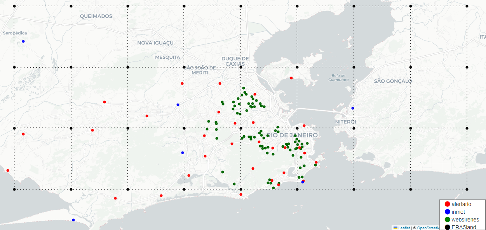
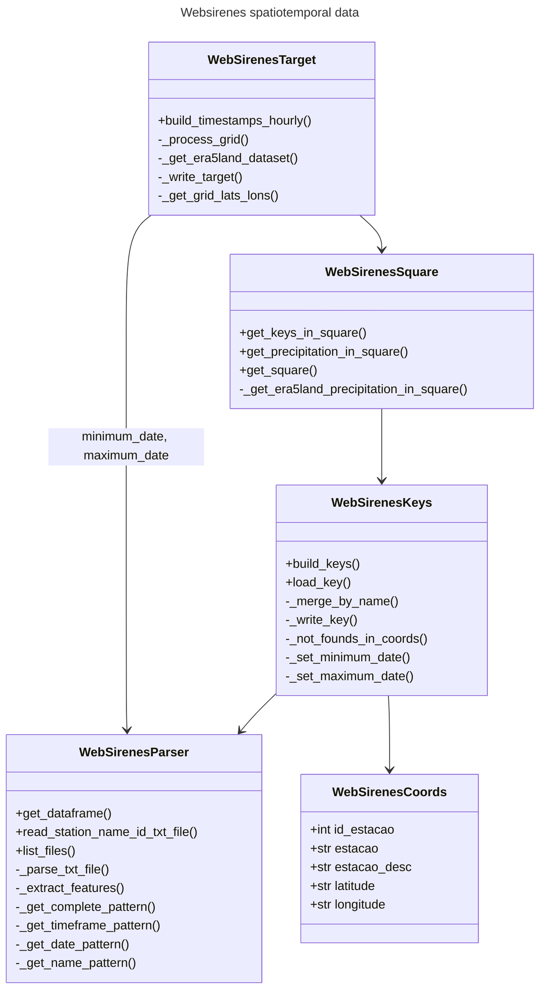

# Spatiotemporal dataset builder

This package build the dataset illustrated in the image below. Currently only integrates WebSirenes data with ERA5Land reanalysis model. A target grid corresponds to a 11x21 matrix of precipitation data, where each cell is a square of 0.1x0.1 degrees. The precipitation data is in mm/hour. The dataset is built hourly, so for each hour we have a grid of precipitation data. The dataset is built from 2011-04-12 20:30:00 to 2022-06-02 21:30:00. The dataset is built for the region of Rio de Janeiro, Brazil.

> TODO integrate AlertaRio and INMET data



1- Place the WebSirenes dataset in the `atmoseer/data/ws/websirenes_defesa_civil` folder. In this folder should exist a list of `.txt` files with the stations' precipitation data.

2- Place the WebSirenes coordinates in the `atmoseer/src/spatiotemporal_builder/websirenes_coords.parquet` folder. In this folder should exist a `websirenes_coords.parquet` file with the stations' coordinates.

Usage for production (integreates Websirenes spatiotemporal data from `2011-04-12 20:30:00` to `2022-06-02 21:30:00`):
```sh
python -m src.spatiotemporal_builder.main
```

The command above is equivalent of running:
```sh
python -m src.spatiotemporal_builder.main --start_date 2011-04-12T20:30:00 --end_date 2022-06-02T21:30:00
```
Passing the `--start_date` and `--end_date` arguments, has the advantage of not having to process keys again to find minimum and maximum dates of the dataset.

For example, usage for building a small dataset. The command below will process 4 hours (i.e. 4 grids of precipitation data) from 2011-04-12-21 to 2011-04-13-00:
```sh
python -m src.spatiotemporal_builder.main --start_date 2011-04-12T21:00:00 --end_date 2011-04-13T00:00:00
```

The diagram below presents the classes and their methods



The `WebSirenesParser` class is responsible for ETL, by reading the WebSirenes dataset in the `websirenes_defesa_civil` folder and extracting the features from the `.txt` files, it returns the data as a pandas Dataframe, the main function of this class is `get_dataframe`.

The `WebSirenesCoords` is responsible for reading and validating the coordinates of the stations from the `websirenes_coords.parquet` file. The coordinates of the stations `websirenes_coords.parquet` came separated from the precipitation measurements `websirenes_defesa_civil` folder. The main attribute 

The `WebSirenesKeys` is responsible for building the keys in the `websirenes_keys` folder. Since the keys need to know the precipitation data and also the station coordinates, it depends on the `WebSirenesParser` and `WebSirenesCoords`. The keys are stored in the `websirenes_keys` folder, this folder contain a list of `lat_lon.parquet` files, each file is a WebSirenes station with the precipitation data. In total we have 83 stations, so we'll have 83 key files.

The `WebSirenesSquare` is responsible for getting the precipitation data in the square. A square is a ``gridpoint`` which has top left, bottom left, top right and bottom right coordinates. A square can include one or more WebSirenes stations or not, the logic for getting the precipitation data is performed in the `get_precipitation_in_square` function.

The `WebSirenesTarget` is responsible for building the target dataset. The target dataset is a grid with the precipitation data. Its main function is `build_timestamps_hourly` where it will build a grid per hour for each day in the dataset. Foe each hour, it will call `_process_grid`, this function processes the grid latitudes top to bottom and longitudes left to right, to build the `Squares` or gridpoints in the grid. It depends on the `WebSirenesSquare` class to get the precipitation data in the square and on the `WebSirenesKeys` to get the minimum and maximum date of the dataset, that was set in the `WebSirenesKeys` when building the keys.

The target dataset will be written in `.npy` files under the `target` folder. 
